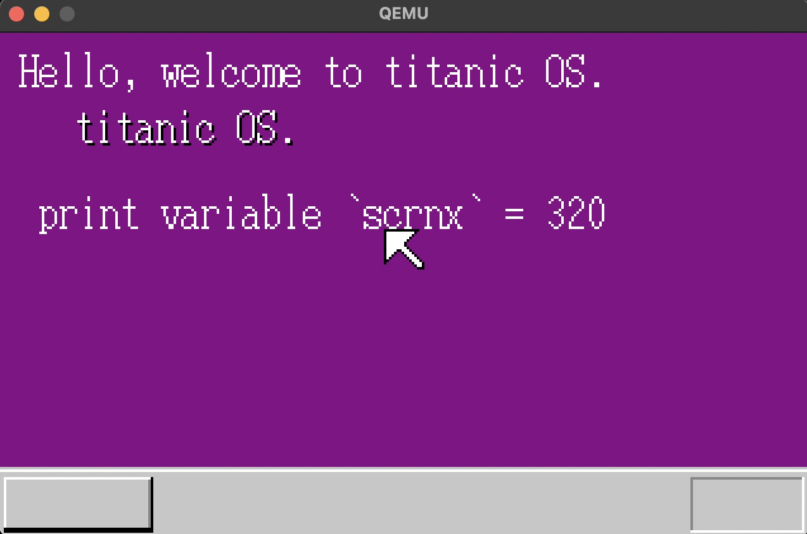

# 《Titanic OS》自制操作系统

项目基于OSASK，开发环境为Linux或Mac，目的在于熟悉OS基本原理，制作一个小型kernal和图形化洁面，并计划添加自己的功能并不断完善。

## 开发环境

本人在aarch64的Mac OS 12上开发，使用工具链为`x86_64-elf-toolchain`与`qemu`或`bochs`等模拟开发板

Mac/linux开发环境依赖:(推荐使用包管理工具如brew一键安装)
```
brew install x86_64-elf-binutils
brew install x86_64-elf-gcc
brew install nasm
brew install mtools
brew install make
brew install qemu-system-i386
```

### 快速执行

cd进入对应目录，并运行`make qemu`启动

```shell
cd day1
make qemu
```

#### 运行效果图(day5)

## 完成效果  


